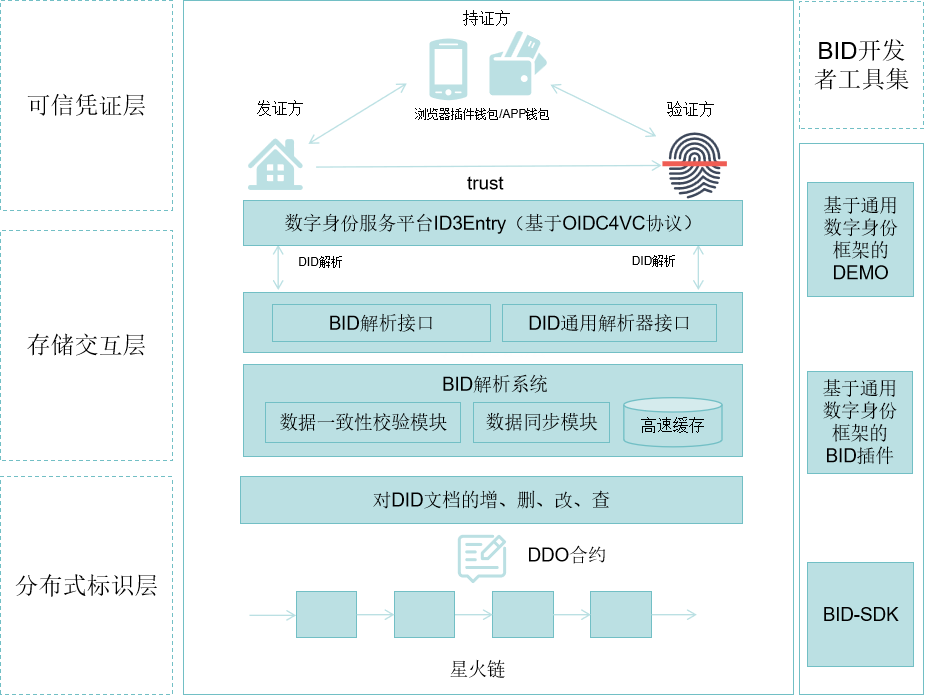

# 1.BID体系介绍

## 1.1 简介

`BID`(`Blockchain-based Identifier`, `BID`)，是基于`W3C DID`标准开发的新型分布式标识，任意实体可自主生，不需要中心化注册机构就可以实现全球唯一性，具有**分布式、自主管理、隐私保护和安全易用**等特点，同时根据算法的不同，`BID`支持`39-57`位**变长编码**方式，有效适应各种业务场景，兼容各类设备。目前，BID 方法已经成功加入[W3C DID 注册表](https://www.w3.org/TR/2024/NOTE-did-spec-registries-20240830/#did-methods)。

`BID`主要包含以下方面：**BID标识符**、**BID文档**、**BID解析协议**、**基于BID的数字凭证**：

- `BID`标识符：

  - 是基于新型分布式标识符`DID`规范的一种方法，任意实体可自主生成`BID`，不需要中心化注册机构就可以实现全球唯一性；
  - **去中心化、互通**

- `BID`文档： 

  -  `BID`标识符只是表示一个身份的标识符，不包含身份的信息。而`BID`文档就是用于描述身份详细信息的文档，一个`BID`标识符关联到一个`BID`文档。`BID`标识符具体解析为`BID`文档，`BID`文档内包括`BID`标识符和公钥详细信息(持有者、加密算法、密钥状态等)，以及`BID`持有者的其他非隐私属性描述等；
  -  **信息承载**

- `BID`解析协议：

  -  星火·标识深耕物联网领域，自主构建了`BID`解析协议，优化了海量物联网设备的接入场景，同时支持`DID`解析器，为星火·链网智能设备自主交互奠定了基础；
  -  **互通**

- 基于`BID`的数字凭证：

  - 提供了一种规范来描述实体所具有的某些属性。`BID`持有者，可以通过可验证声明，向其他实体证明自己的某些属性是可信的。结合数字签名和零知识证明等密码学技术，可以使得声明更加安全可信，并进一步保障用户隐私不被侵犯；

  - **隐私**

    

## 1.2 总体架构

基于星火链网的BID总体架构分为：分布式标识层、存储交互层、可信凭证层和开发者工具集。

**分布式标识层**：分布式标识层主要是由星火链、链上的DDO智能合约组成。对外提供对DID文档的增、删、改、查和权限校验功能，本质上是一种去中心化公钥基础设施 (DPKI)。

**存储交互层**：存储交互层主要由BID解析系统和对外的解析接组成。BID解析系统内部分为基于内核态的高速缓存模块、链上数据同步模块和链上链下数据一致性校验模块。对外通过BID解析接口和DID通用解析器接口提供BID解析服务。

**可信凭证层**:可信凭证层主要由分布式数字身份服务平台ID3Entry、浏览器插件钱包以及APP数字身份钱包组成，其中分布式数字身份服务平台ID3Entry基于OIDC4VC协议。可信凭证层为发证方、持证方和验证方提供凭证交换验证服务。

**开发者工具集**：开发者工具集包括BID-SDK、BID命令行工具、基于通用数字身份框架的BID插件和基于通用数字身份框架的演示Demo。BID-SDK可以连接星火链和BID解析系统，开发者可以将BID-SDK集成到自己的系统中，实现BID标识符的生成以及BID文档的增、删、改、查等功能；基于通用数字身份框架的BID插件以插件的形式提供BID的相关功能，方便BID与其他DID之间实现异构DID互通；基于通用数字身份框架Demo提供基于OIDC4VC协议的可信凭证交换用例。

