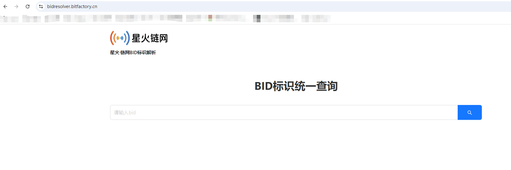
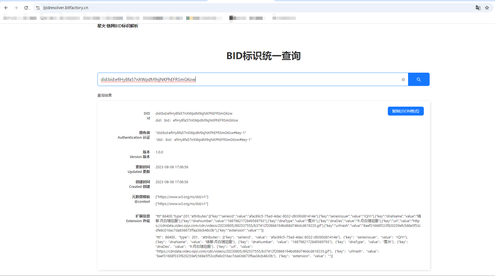
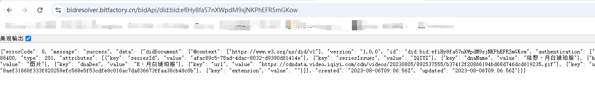
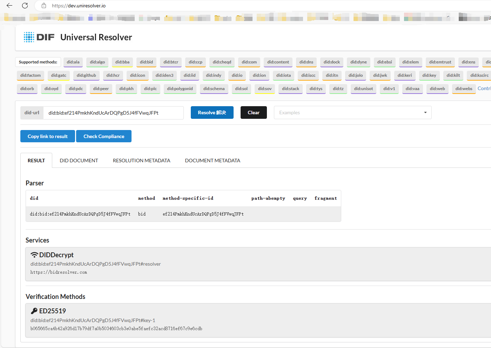
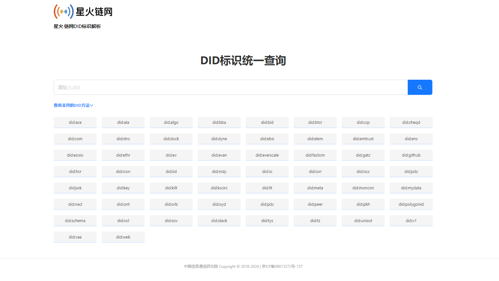

# 4.BID解析

## 4.1 概述

BID 解析是获取给定BID的DID文档的过程。

## 4.2 BID解析协议

BID解析协议的主要目标是设计一种基于分布式标识符DID规范的、基于星火链网分层架构的、可以实现寻址功能和数字身份功能的、工业互联网和物联网场景下的高性能标识解析协议。

**[BID解析协议](https://bid-resolution-protocol-doc.readthedocs.io/zh-cn/latest/index.html)**

## 4.3 BID解析页面

**[BID解析页面](https://bidresolver.bitfactory.cn)**

BID解析页面是星火链上的一种数据可视化工具，用户可以通过web页面，直接在浏览器上解析BID标识。

### 4.3.1 检索首页

### 4.3.2 BID信息

在BID标识查询页面中，检索结果页会展示该BID标识的详细。

## 4.4BID解析接口

http://bidresolver.bitfactory.cn/bidApi/$BID

其中$BID为要解析的BID, 解析结果示例如下：

## 4.5 DID通用解析器

DID通用解析器是Linux基金会下面的分布式数字身份基金会DIF实现的统一DID解析方案，2020年，BID解析驱动正式提交至DID通用解析器，实现了BID的全球可解析。

**[DID通用解析器地址](https://dev.uniresolver.io/)**

## 4.6 商业化的DID通用解析器

我们自己研发了商业化的DID通用解析器，支持几十种异构的DID解析，同时解析器内部实现了高速缓存，并对不同的DID解析驱动进行实时的健康检查，可以保障服务的可用性。

**[商业化的DID通用解析器地址](http://bidresolver.bitfactory.cn/did)**

