# 6. BID工具

## 6.1.BID-SDK

<a name="RPOky"></a>

**GitHub地址：[https://github.com/caict-4iot-dev/BID-SDK-JAVA](https://github.com/caict-4iot-dev/BID-SDK-JAVA)**

<a name="mzYWs"></a>

### 6.1.1 简介

BID-SDK通过API调用的方式提供了“星火链网”公私钥对生成、“星火链网”私钥签名公钥验签、`BID`标识生成、`BID`标识验证等接口，同时还提供了接口使用示例说明，开发者可以调用该SDK方便快捷的生成星火链网公私钥对和`BID`地址，实现`BID`标识合法性的校验及主链的快速接入。中国信通院秉持开源开放的理念，将星火“BID-SDK”面向社区和公众完全开源，助力全行业伙伴提升数据价值流通的效率，实现数据价值转化。<a name="FQBXC"></a>

### 6.1.2  环境准备

#### 6.1.2.1 软件依赖

**java**：版本jdk 1.8.0_202或以下

下载地址：https://www.oracle.com/java/technologies/javase/javase-jdk8-downloads.html

若已安装，请通过命令查看版本：

```sh
$ java -version
java version "1.8.0_202"
```

#### 6.1.2.2 下载安装

```http
$ git clone -b release/1.0.0  --depth=1 https://github.com/caict-4iot-dev/BID-SDK-JAVA.git
```

### 6.1.3 基本概念介绍

BID开发工具包，主要是为了方便开发者可以快速加入到星火主链的生态建设中，有以下功能：  

- 获取版本号：获取`BID-SDK`版本号。

- BID工具：生成`BID`标识和验证`BID`地址格式的合法性。  

- 公私钥工具：生成星火格式的公私钥、使用星火格式的私钥生成签名、使用星火格式的公钥生成签名。    

- BID标识工具：创建`BID`文档模板、创建`BID`文档、查询`BID`文档、校验`BID`文档。     

### 6.1.4 参考文档

参考文档：[《BID解析协议》](https://bid-resolution-protocol-doc.readthedocs.io/zh_CN/latest/)

### 6.1.5 离线API

#### 6.1.5.1 获取版本号

1. 接口 ` getSdkVersion()`

1. 用途:

   用来获取BID-SDK版本号。

1. 示例

   ```java
       //创建SDK实例
       SDK sdk = new SDK();
       String sdkVersion= sdk.getSdkVersion();
       System.out.println(sdkVersion);
   ```

#### 6.1.5.2 账户生成

1. 接口 ` getBidAndKeyPair()`

1. 用途:

   用来生成一个星火链`BID`地址和对应私钥。

1. 示例

   ```java
       //创建SDK实例
       SDK bidSdk = new SDK();
       KeyPairEntity kaypairEntity = bidSdk.getBidAndKeyPair();
       String publicKey = kaypairEntity.getEncPublicKey();
       String privateKey = kaypairEntity.getEncPrivateKey();
       String bid = kaypairEntity.getEncAddress();
       System.out.println(publicKey);
       System.out.println(privateKey);
       System.out.println(bid);
   ```

#### 6.1.5.3 根据编码类型生成账户

1. 接口 ` getBidAndKeyPair(KeyType)`

1. 用途:

   根据编码类型生成一个星火链`BID`地址和对应私钥。

1. 示例

   ```java
       //创建SDK实例
       SDK bidSdk = new SDK();
       KeyPairEntity kaypairEntity = bidSdk.getBidAndKeyPair(KeyType.ED25519);
       String publicKey = kaypairEntity.getEncPublicKey();
       String privateKey = kaypairEntity.getEncPrivateKey();
       String bid = kaypairEntity.getEncAddress();
       System.out.println(publicKey);
       System.out.println(privateKey);
       System.out.println(bid);
   ```

#### 6.1.5.4 根据编解码类型和ChainCode生成账户

1. 接口 ` getBidAndKeyPair(KeyType,chaincode)`

1. 用途:

   根据编解码类型和`ChainCode`生成星火链`BID`地址和对应私钥。

1. 示例

   ```java
       //创建SDK实例
       SDK bidSdk = new SDK();
       KeyPairEntity kaypairEntity = bidSdk.getBidAndKeyPair(KeyType.SM2,"aa1c" );
       String publicKey = kaypairEntity.getEncPublicKey();
       String privateKey = kaypairEntity.getEncPrivateKey();
       String bid = kaypairEntity.getEncAddress();
       System.out.println(publicKey);
       System.out.println(privateKey);
       System.out.println(bid);
   ```

### 6.1.6 在线API

#### 6.1.6.1 获取BID文档模板

1. 接口 ` getBIDTemplate()`

1. 用途:

   用来获取一个星火链`BID`文档模板。

1. 示例

   ```java
       //创建SDK实例
       SDK bidSdk = new SDK();
       Result result = sdk.getBIDTemplate();
       System.out.println(result);
   ```

#### 6.1.6.2 创建BID文档

1. 接口 ` createBIDByTemplate(bidDocument)`

1. 用途:

   根据星火链`BID`文档模板创建`BID`文档。

1. 示例

   ```java
        //bid文档
        String request ="{\"bifamount\":0,\"senderAddress\":\"did:bid:efZfEeQAE1jup1H9musAZP1S3PqV3UdF\",\"feeLimit\":1000000,\"BIFAmount\":0,\"bid\":[{\"document\":{\"version\":\"1.0.0\",\"id\":\"did:bid:efWH8wDnogNijNJWiaWJcZ33QSEF9beH\",\"publicKey\":[{\"id\":\"did:bid:efWH8wDnogNijNJWiaWJcZ33QSEF9beH#key-1\",\"type\":\"ED25519\",\"publicKeyHex\":\"b0656631627656f082b438a747164c2c9abbe5dd72a0582bdbf404e959c133b89b723e\",\"controller\":\"did:bid:efWH8wDnogNijNJWiaWJcZ33QSEF9beH\"}],\"authentication\":[\"did:bid:efZfEeQAE1jup1H9musAZP1S3PqV3UdF#key-1\"],\"alsoKnownAs\":[{\"id\":\"did:bid:efWH8wDnogNijNJWiaWJcZ33QSEF9beH\",\"type\":101}],\"extension\":{\"recovery\":[\"did:bid:efWH8wDnogNijNJWiaWJcZ33QSEF9beH#key-2\"],\"ttl\":86400,\"type\":102,\"delegateSign\":{\"signer\":\"did:bid:efWH8wDnogNijNJWiaWJcZ33QSEF9beH#key-1\",\"signatureValue\":\"A897845DAD953A68BCF22F31FC7EE2BB316EDA74D0BA5C02D99FF99981E610E50659D65EB2082D30312E91D677E7CFDAF3773155BBEE330E3C67412786E2BD01\"},\"attributes\":[{\"key\":\"name\",\"desc\":\"名称\",\"value\":\"BID文档\",\"format\":\"text\",\"encrypt\":1}],\"acsns\":[\"acsn\"],\"verifiableCredentials\":[{\"id\":\"did:bid:efWH8wDnogNijNJWiaWJcZ33QSEF9beH\",\"type\":201}]},\"service\":[{\"id\":\"did:bid:efWH8wDnogNijNJWiaWJcZ33QSEF9beH#resolver\",\"type\":\"DIDDecrypt\",\"protocol\":2,\"serverType\":0,\"serviceEndpoint\":\"https://bidresolver.com\"}],\"created\":\"2022-09-09T17:37:19Z\",\"updated\":\"2022-09-09T17:37:19Z\",\"proof\":{\"creator\":\"did:bid:efWH8wDnogNijNJWiaWJcZ33QSEF9beH#key-1\",\"signatureValue\":\"BCB3818AFC60C2121D88A6E6AF9B4FBD4F36931D27428DD72E149EF37E6E5A413787585E7E52BA32CCEA52AC3EB36664FCDAF8EBD02BC116F8875AFF00E28700\"},\"@context\":[\"https://www.w3.org/ns/did/v1\"]}},{\"document\":{\"version\":\"1.0.0\",\"id\":\"did:bid:efgeUN1NrZ8g8emyaxMrpH6yKZvTfar7\",\"publicKey\":[{\"id\":\"did:bid:efgeUN1NrZ8g8emyaxMrpH6yKZvTfar7#key-1\",\"type\":\"ED25519\",\"publicKeyHex\":\"b065668a2dd499847a0e4edec1560e7c10a2366b671a96011461fdcf1455d27e6b5d2a\",\"controller\":\"did:bid:efgeUN1NrZ8g8emyaxMrpH6yKZvTfar7\"}],\"authentication\":[\"did:bid:efZfEeQAE1jup1H9musAZP1S3PqV3UdF#key-1\"],\"alsoKnownAs\":[{\"id\":\"did:bid:efgeUN1NrZ8g8emyaxMrpH6yKZvTfar7\",\"type\":101}],\"extension\":{\"recovery\":[\"did:bid:efgeUN1NrZ8g8emyaxMrpH6yKZvTfar7#key-2\"],\"ttl\":86400,\"type\":102,\"delegateSign\":{\"signer\":\"did:bid:efgeUN1NrZ8g8emyaxMrpH6yKZvTfar7#key-1\",\"signatureValue\":\"DD3CCC07EDB286A4AEC2A2A63562A498C8582EDA3CE779425D86FE46D5F6774EF0831E9F03FCAA579882F20F21FCAD6616D62689D360AC8159F4414F112D2F09\"},\"attributes\":[{\"key\":\"name\",\"desc\":\"名称\",\"value\":\"BID文档\",\"format\":\"text\",\"encrypt\":1}],\"acsns\":[\"acsn\"],\"verifiableCredentials\":[{\"id\":\"did:bid:efgeUN1NrZ8g8emyaxMrpH6yKZvTfar7\",\"type\":201}]},\"service\":[{\"id\":\"did:bid:efgeUN1NrZ8g8emyaxMrpH6yKZvTfar7#resolver\",\"type\":\"DIDDecrypt\",\"protocol\":2,\"serverType\":0,\"serviceEndpoint\":\"https://bidresolver.com\"}],\"created\":\"2022-09-09T17:45:09Z\",\"updated\":\"2022-09-09T17:45:09Z\",\"proof\":{\"creator\":\"did:bid:efgeUN1NrZ8g8emyaxMrpH6yKZvTfar7#key-1\",\"signatureValue\":\"3A6C2D2601CA3A78EA3C736D3D5E93AFF194BF32CC45CE308AFC47854BDDD72A81776F88798B83D56E2770BFDFDBCC3A250D51CDB63C45E34773ED910C2F770F\"},\"@context\":[\"https://www.w3.org/ns/did/v1\"]}}],\"ceilLedgerSeq\":0,\"remarks\":\"creat DDO\",\"privateKey\":\"priSPKhJ59Y6EePWbFybWzNkhPGjJ1ReQBeFk3KgaC2nFz4Nfy\",\"gasPrice\":1000}";
        SDK sdk = SDK.getInstance("http://test.bifcore.bitfactory.cn/");
        Result result = sdk.createBIDByTemplate(request);
        System.out.println(result);
   ```

#### 6.1.6.3 解析BID文档

1. 接口 `resolverBid(bid)`

1. 用途:

   用来查询`BID`文档。

1. 示例

   ```java
      //创建SDK实例
      SDK sdk = SDK.getInstance("http://test-bidresolver.bitfactory.cn");
      String bid="did:bid:efj3FikDU8c7An3SPUoRtEWf2JDg1Hg9";
      Result result = sdk.resolverBid(bid);
      System.out.println(result);
   ```

## 6.2 基于通用数字身份框架的BID插件

### 6.2.1 整体架构

通用数字身份框架[Veramo](https://veramo.io/) 是一个 JavaScript 框架，使任何人都可以轻松地在其应用程序中使用加密可验证的数据。它旨在让想要使用 DID、可验证凭证和以数据为中心的协议的开发人员能够轻松地为其用户带来下一代功能。

基于Veramo框架，我们研发了BID插件，主要有以下特性：

1. **互操作性强**：BID以插件形式无缝集成到veramo框架，可以很方便的实现与其他异构DID的互操作。
2. **模块化的设计**：BID插件采用了模块化的设计原则，它们以独立于Veramo框架的其他部分进行更新和维护。
3. **易于集成**：BID插件提供了详细的文档和示例代码，帮助开发者快速理解如何将这些插件集成到他们的应用程序中。

以下是基于Veramo框架的BID插件设计架构：

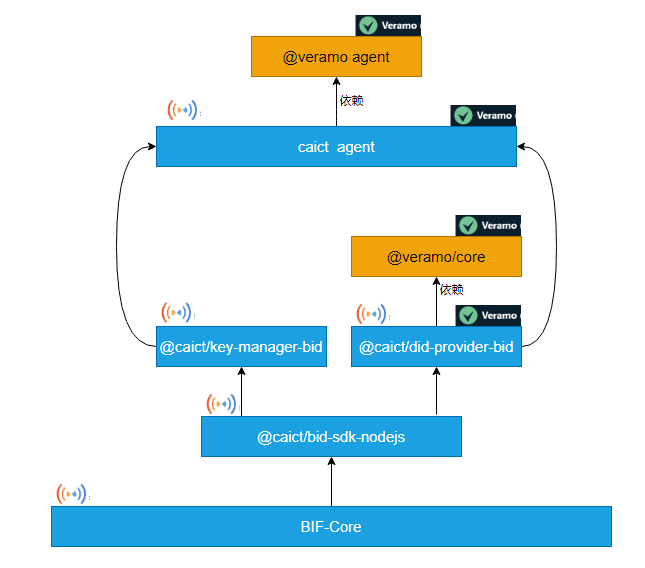

### 6.2.2 插件安装

1. 拉取项目

   ```
   git clone https://github.com/decentralized-identity/veramo.git
   cd veramo
   npm -g i pnpm
   pnpm install
   npm install -g @caict/did-provider-bid 
   npm install -g @caict/key-manager-bid 
   ```

2. 创建配置文件

   ```
   veramo config create
   ```

   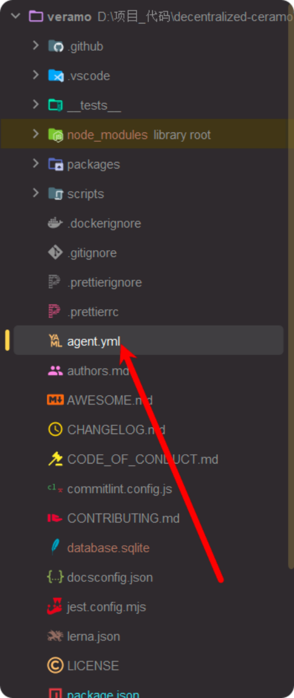


3. 在配置文件中加载插件

   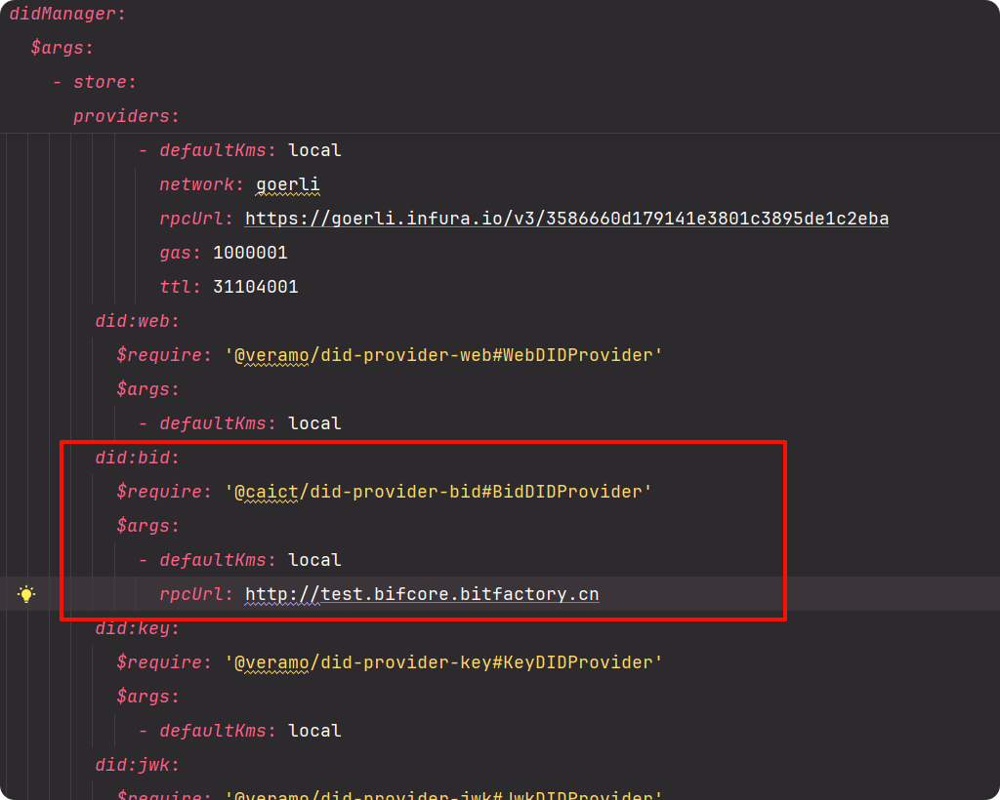


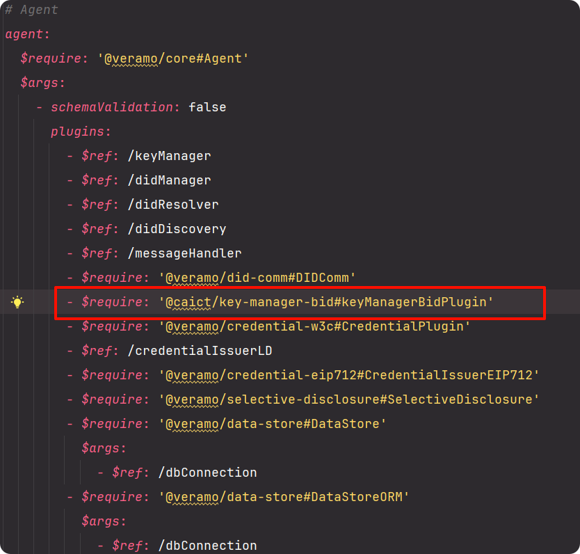

### 6.2.3 @caict/key-manager-bid插件

**1. bid生成**

**请求参数**

Null

**请求示例:**

```
agent.generateAddress()
```

**响应参数说明:**

| 参数   | 类型   | 说明   |
| ------ | ------ | ------ |
| priKey | object | priKey |

**响应示例:**

```json
{
  "errorCode":0,
  "errorDesc":"Success",
  "result":{
    priKey: {
      encPrivateKey: 'priSPKkDjQbcx2qcUmX6WMjmxJLbJSVYBnCm8Ljb3x8K2AWV1b',
      encPublicKey: 'b06566362a8bd7ab612ab8f52c8b96c2cddf2cbbac444982963ed0a5856bed151f62b0',
      encAddress: 'did:bid:ef27HGEBjxWsSCoKbpEbP2FPPKT97yw1A',
      rawPrivateKey: [
        101, 176,  49, 126,  27, 254, 118, 162,
        245,  48,  82, 137, 204,  80,  87, 127,
        110,  70, 127, 143, 223,  53,  45,  70,
        226, 128, 155,  35, 134, 115, 254, 178
      ],
      rawPublicKey: [
        54,  42, 139, 215, 171,  97,  42, 184,
        245,  44, 139, 150, 194, 205, 223,  44,
        187, 172,  68,  73, 130, 150,  62, 208,
        165, 133, 107, 237,  21,  31,  98, 176
      ]
    }
  };
}
```

**2. 签名**

**请求参数**

| 参数       | 类型   | 是否必传 | 说明   |
| ---------- | ------ | -------- | ------ |
| message    | string | 是       | 签名体 |
| privateKey | string | 是       | 私钥   |

**请求示例:**

```
agent.sign({message,privateKey})
```

**响应参数说明:**

| 参数      | 类型   | 说明     |
| --------- | ------ | -------- |
| message   | string | 原文     |
| signature | string | 签名信息 |
| publicKey | string | 公钥     |

**响应示例:**

```
{
  "errorCode":0,
  "errorDesc":"Success",
  "result":{
    message:””,
    signature:””
    publicKey:””
  };
}
```

**3.验签**

**请求参数**

| 参数      | 类型   | 说明       |
| --------- | ------ | ---------- |
| message   | string | 原文       |
| signature | string | 签名后信息 |
| publicKey | string | 公钥       |

**请求示例:**

```
agent.verify({message,signature,publicKey})
```

**响应参数说明:**

| 参数    | 类型    | 说明     |
| ------- | ------- | -------- |
| verify  | Boolean | 验证结果 |
| message | string  | 错误信息 |

**响应示例:**

```json

{
  "errorCode":0,
  "errorDesc":"Success",
  "result":{
    verify:success,
    message:””
  };
}
```

**4. 生成文档模版**

**请求参数**

| 参数       | 类型   | 是否必传 | 说明 |
| ---------- | ------ | -------- | ---- |
| bid        | string | 否       | bid  |
| privateKey | string | 否       | 私钥 |
| publicKey  | string | 否       | 公钥 |

bid等参数不传 会自动创建一个新的bid

**请求示例:**

```
agent.generateDocumentTemplate({bid,privateKey,publicKey})
```

**响应参数说明:**

| 参数        | 类型   | 说明    |
| ----------- | ------ | ------- |
| biddocument | string | bid文档 |
| priKey      | Object | priKey  |

**响应示例:**

```json
{
  "errorCode":0,
  "errorDesc":"Success",
  "result":{
    priKey: {
      encPrivateKey: 'priSPKkDjQbcx2qcUmX6WMjmxJLbJSVYBnCm8Ljb3x8K2AWV1b',
      encPublicKey: 'b06566362a8bd7ab612ab8f52c8b96c2cddf2cbbac444982963ed0a5856bed151f62b0',
      encAddress: 'did:bid:ef27HGEBjxWsSCoKbpEbP2FPPKT97yw1A',
      rawPrivateKey: [
        101, 176,  49, 126,  27, 254, 118, 162,
        245,  48,  82, 137, 204,  80,  87, 127,
        110,  70, 127, 143, 223,  53,  45,  70,
        226, 128, 155,  35, 134, 115, 254, 178
      ],
      rawPublicKey: [
        54,  42, 139, 215, 171,  97,  42, 184,
        245,  44, 139, 150, 194, 205, 223,  44,
        187, 172,  68,  73, 130, 150,  62, 208,
        165, 133, 107, 237,  21,  31,  98, 176
      ]
    },
    document: {
      '@context': [ 'https://w3.org/ns/did/v1' ],
      id: 'did:bid:ef27HGEBjxWsSCoKbpEbP2FPPKT97yw1A',
      version: '1.0.0',
      authentication: [ 'did:bid:ef27HGEBjxWsSCoKbpEbP2FPPKT97yw1A#key-1' ],
      publicKey: [ [Object] ],
      alsoKnownAs: [ [Object] ],
      extension: {
        recovery: [Array],
        ttl: 86400,
        'delegateSign ': [Object],
        type: 102,
        attributes: [Array],
        acsns: [Array],
        verifiableCredentialsOperations: [Array]
      },
      service: [ [Object] ],
      created: '2024-07-29T05:52:14.441Z',
      updated: '2024-07-29T05:52:14.441Z'
    }
  };
}

```

**5. 文档签名**

**请求参数**

| 参数       | 类型   | 是否必传 | 说明 |
| ---------- | ------ | -------- | ---- |
| privateKey | string | 否       | 私钥 |
| document   | string | 否       | 文档 |

**请求示例:**

```
agent.generateDocumentProof({document, privateKey})
```

**响应参数说明:**

| 参数     | 类型   | 说明    |
| -------- | ------ | ------- |
| document | string | bid文档 |

**响应示例:**

```json
{
  "errorCode":0,
  "errorDesc":"Success",
  "result":{ document: {
    '@context': [ 'https://w3.org/ns/did/v1' ],
    id: 'did:bid:ef27HGEBjxWsSCoKbpEbP2FPPKT97yw1A',
    version: '1.0.0',
    authentication: [ 'did:bid:ef27HGEBjxWsSCoKbpEbP2FPPKT97yw1A#key-1' ],
    publicKey: [ [Object] ],
    alsoKnownAs: [ [Object] ],
    extension: {
      recovery: [Array],
      ttl: 86400,
      'delegateSign ': [Object],
      type: 102,
      attributes: [Array],
      acsns: [Array],
      verifiableCredentialsOperations: [Array]
    },
    service: [ [Object] ],
    created: '2024-07-29T05:52:14.441Z',
    updated: '2024-07-29T05:52:14.441Z',
    proof:{
      message:””,
      signatuare:””,
    }
  }};
}
```

**6. 文档验签**

**请求参数**

| 参数       | 类型   | 是否必传 | 说明 |
| ---------- | ------ | -------- | ---- |
| privateKey | string | 否       | 私钥 |
| document   | string | 否       | 文档 |

**请求示例:**

```
agent.generateDocumentProof({document: JSON.Stringify(document),privateKey})
```

**响应参数说明:**

| 参数    | 类型    | 说明     |
| ------- | ------- | -------- |
| success | Boolean | 验证结果 |

**响应示例:**

```json
{
  "errorCode":0,
  "errorDesc":"Success",
  "result":{success: true, message: "Sign Success!"};
}
```

### 6.2.4 @caict/did-provider-bid插件

**1. BID文档的注册**

**接口名称:**新增文档

**请求参数**

| 参数        | 类型   | 是否必传 | 说明    |
| ----------- | ------ | -------- | ------- |
| bidDocument | string | 是       | bid文档 |

**请求示例:**

```
provider.createIdentifier({bidDocument})
```

**响应参数说明:** 

| 参数 | 类型   | 说明 |
| ---- | ------ | ---- |
| hash | string | hash |

**响应示例:**

```javascript
{

  "errorCode":0,

  "errorDesc":"Success",

  "result":{"hash":"f900bcf9e8b318ad2f86c917ea5769ddb3cdac6514c7aca19e280532286c8e3c"}

}
```

**2. BID文档的修改**

**接口名称:**文档修改

**请求参数**

| 参数        | 类型   | 是否必传 | 说明    |
| ----------- | ------ | -------- | ------- |
| bidDocument | string | 是       | bid文档 |

**请求示例:**

```javascript
provider.updateIdentifier({bidDocument})
```

**响应参数说明:** 

| 参数 | 类型   | 说明 |
| ---- | ------ | ---- |
| hash | string | hash |

**响应示例:**

 ```
{

"errorCode":0,

"errorDesc":"Success",

"result":{"hash":"f900bcf9e8b318ad2f86c917ea5769ddb3cdac6514c7aca19e280532286c8e3c"}

}
 ```

**3.BID文档的删除**

**接口名称:**文档删除

**请求参数**

| 参数        | 类型   | 是否必传 | 说明    |
| ----------- | ------ | -------- | ------- |
| bidDocument | string | 是       | bid文档 |

**请求示例:**

```
provider.deleteIdentifier({bidDocument})
```

**响应参数说明:**

| 参数 | 类型   | 说明 |
| ---- | ------ | ---- |
| hash | string | hash |

**响应示例:**

```
{

"errorCode":0,

"errorDesc":"Success",

"result":{"hash":"f900bcf9e8b318ad2f86c917ea5769ddb3cdac6514c7aca19e280532286c8e3c"}

}
```

**4 BID文档的查询**

**接口名称:** 文档查询

**请求参数** 

| 参数 | 类型   | 是否必传 | 说明 |
| ---- | ------ | -------- | ---- |
| bid  | string | 是       | bid  |

 **请求示例:**

```
provider.findIdentifierByBid({bid}); 
```

**响应参数说明:**

| 参数        | 类型   | 说明    |
| ----------- | ------ | ------- |
| biddocument | string | bid文档 |

**响应示例:**

```
{

"errorCode":0,

"errorDesc":"Success",

"result":{"bidDocument":"{\"@context\":[\"https://w3.org/ns/did/v1\"],\"id\":\"did:bid:efnLDXexDs1TsSZdtRmrrKHW3kFvoyFN\",\"version\":\"2\",\"authentication\":[\"did:bid:efwkGc1NVsM2tpTEwsjvrcqEkFqQ4Eu5#key-1\"]}"}

}

```

**5 BID解析**

**接口名称:**bid解析

 **请求参数**

| 参数 | 类型   | 是否必传 | 说明 |
| ---- | ------ | -------- | ---- |
| bid  | string | 是       | bid  |

**请求示例:**

```
provider.reslover({bid})
```

**响应参数说明:**

| 参数        | 类型   | 说明    |
| ----------- | ------ | ------- |
| biddocument | string | bid文档 |

**响应示例:**

```
{
    "errorCode": 0,
    "message": "success",
    "data": {
        "bidDocument": {
            "@context": [
                "https://www.w3.org/ns/did/v1"
            ],
            "version": "1.0.0",
            "id": "did:bid:efB4bhwaodhtTGnGKZgN38bYVcEENnUb",
            "authentication": [
                "did:bid:efB4bhwaodhtTGnGKZgN38bYVcEENnUb#key-1"
            ],
            "extension": {
                "ttl": 86400,
                "type": 201,
                "attributes": [
                    {
                        "key": "seriesId",
                        "value": "5b7df9e6-100a-40ec-9501-906320989ce8"
                    },
                    {
                        "key": "seriesIssuer",
                        "value": "wcq交易所"
                    },
                    {
                        "key": "dnaName",
                        "value": "101017-04"
                    },
                    {
                        "key": "dnaNumber",
                        "value": "1"
                    },
                    {
                        "key": "dnaType",
                        "value": "图片"
                    },
                    {
                        "key": "dnaDes",
                        "value": ""
                    },
                    {
                        "key": "url",
                        "value": "https://digital-transaction-dev.oss-cn-shanghai.aliyuncs.com/images/2024/07/09/17205120711781941.png"
                    },
                    {
                        "key": "urlHash",
                        "value": "3708f7d80180e7e3386185b5582a3b538a6c3a2b68cd24d5ebb5bb4949c14f4e"
                    },
                    {
                        "key": "extension",
                        "value": ""
                    }
                ]
            },
            "created": "2024-07-10T10:51:16Z",
            "updated": "2024-07-10T10:51:16Z"
        }
    }
}
```

 ## 6.4 基于BID的数字身份演示Demo

我们提供了基于BID的数字身份演示Demo, 帮助大家理解整个数字身份生命周期中凭证的申请、颁发、出示和验证流程。

### 6.4.1 工作流程

1. 登录:采用钱包登录
2. 凭证查询:用户去发证方进行凭证查询
3. 凭证申请:用户向指定的发证方提交可验证声明申请，并提供相关材料 
4. 颁发证书:发证方审核完材料后，给用户颁发可验证声明
5. 凭证列表:展示持证者申请的可验证凭证
6. 凭证核验:把凭证发送给验证方来进行核验
7. 返回核验结果:验证方核验后，返回用户凭证的核验结果
8. `BID`解析: 获取公钥,agent地址等信息

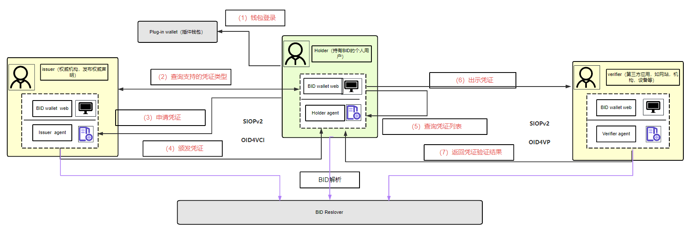

### 6.4.2 角色说明

**BID wallet web**

`BID wallet web`（钱包 web 端），作为用户端，方便用户（`Holder`）进行凭证的管理。

具备以下功能：

- `BID`解析
- `BID`文档的 `CRUD`
- 凭证申请
- 凭证核验
- 凭证查看

**Holder**

`Holder`是持有`BID`的个人用户，主要功能：

- 凭证查看
- 凭证申请
- `BID`解析
- `BID`文档的 `CRUD`

**issuer**

`issuer`是权威机构，发布权威声明，主要功能：

- 凭证发布
- 凭证审核

**verifier**

`verifier`是能够使用`BID`的第三方应用，例如网站、移动APP之类，主要功能：

- 凭证的核验

**BID 解析器**

`BID Resolver`提供`BID`的解析服务，能够根据`BID`查询对应的`BID`文档。

### 6.4.3 使用说明

#### 6.4.3.1 Holder

##### 服务说明：

|      | 服务名       | 端口 |
| ---- | ------------ | ---- |
| 前端 | holder-web   | 8888 |
| 后端 | holder-agent | 7001 |

##### 项目配置

###### 前端

1. node环境

   `18.17.0`

2. 后端接口地址配置

   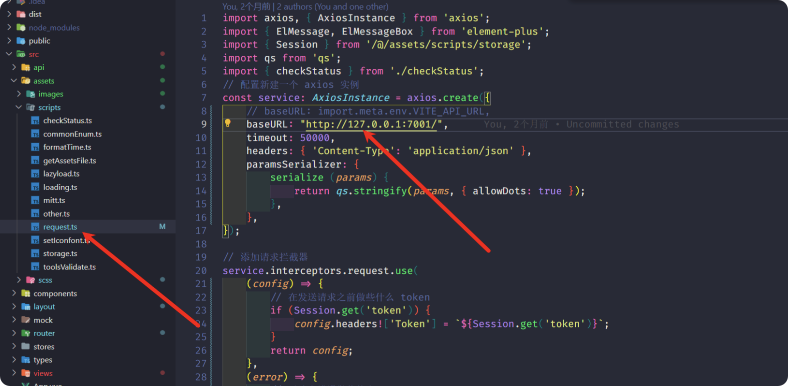

3. 启动项目

```
cd holder-web
npm install
npm run serve
```

###### 后端

1. node环境

	`18.17.0`

2. 项目配置

	端口号配置

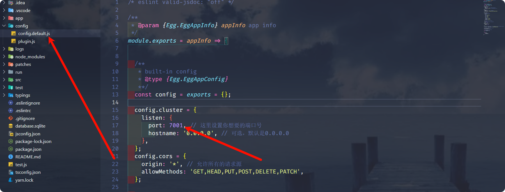

数据库配置


3. 启动项目

```
cd holder-agent
npm install
npm run dev
```

##### 项目说明

###### 访问地址

` http://localhost:8888/login-scan`

1. 进入登录页面点击登录 使用钱包登录

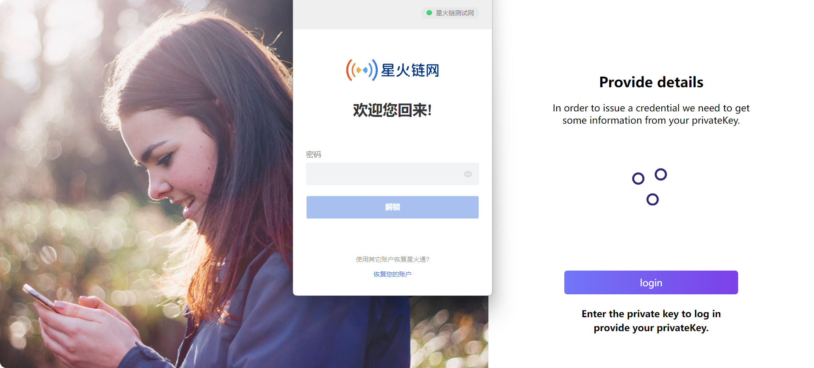

2. 进入系统后 首先展示的是凭证的展示页面


3. 凭证申请

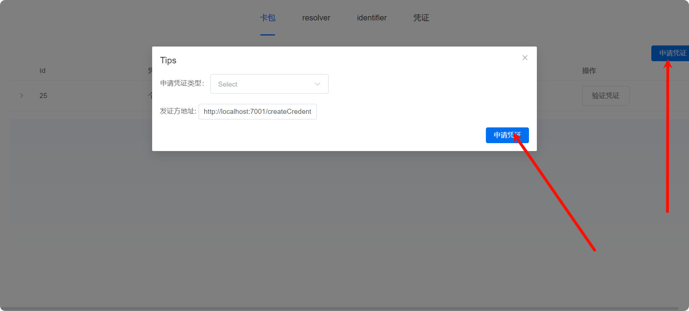

申请之后 需要到`issuer`系统进行审核，并颁发凭证

4. 申请成功后，进行查看

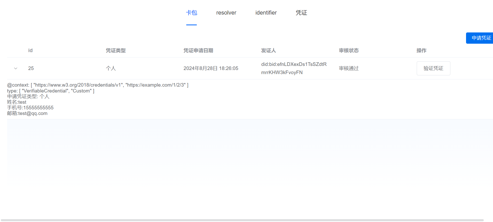

5. 点击验证凭证 可以查看凭证的信息并进行验证

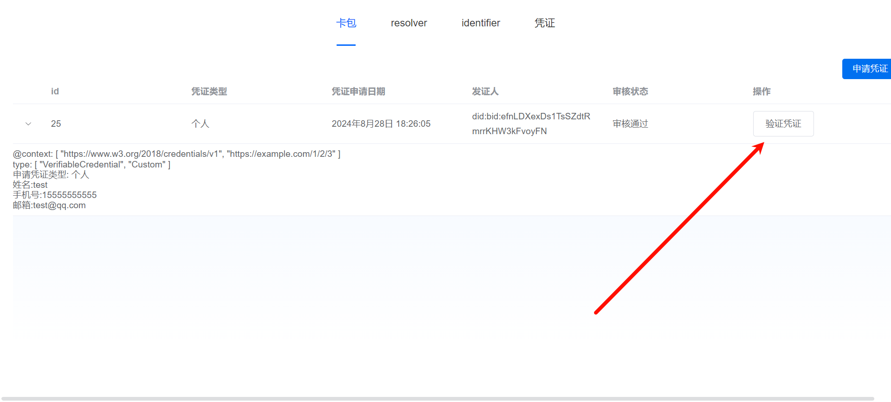

6. 弹窗可以展示凭证的信息 以及可以发送到验证方进行凭证验证

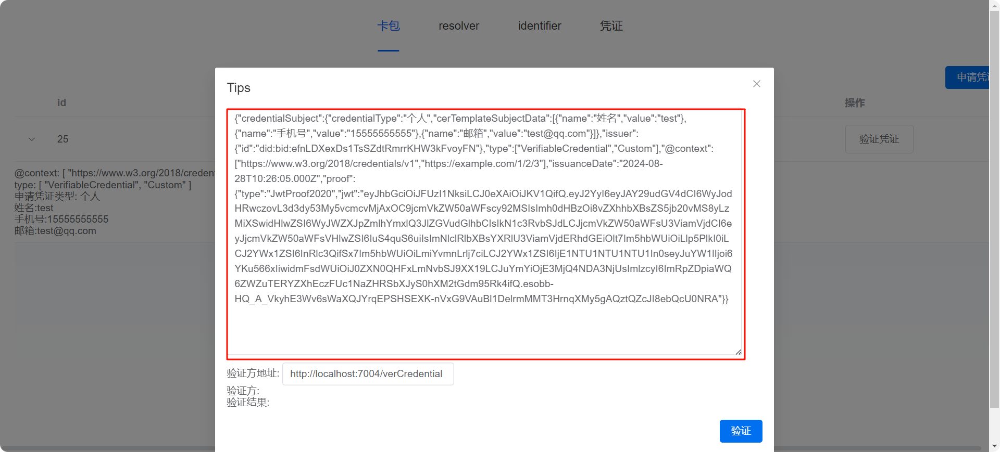

可以输入验证方地址 将自己的凭证发给验证方进行验证 之后需要到`verifier`系统进行凭证的验证

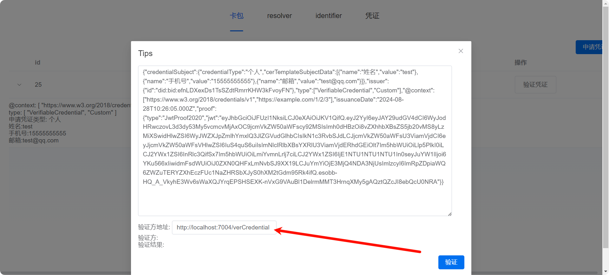

7. 可以进行bid的解析


8. 文档的信息展示

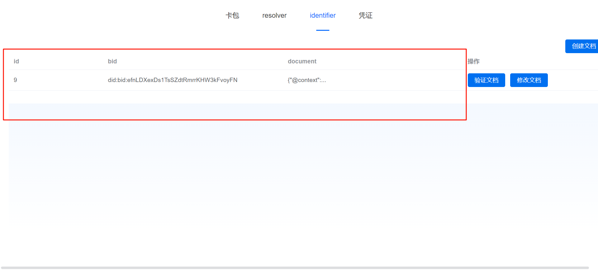

9. 创建文档数据

   1）首先输入私钥 来生产文档模版 

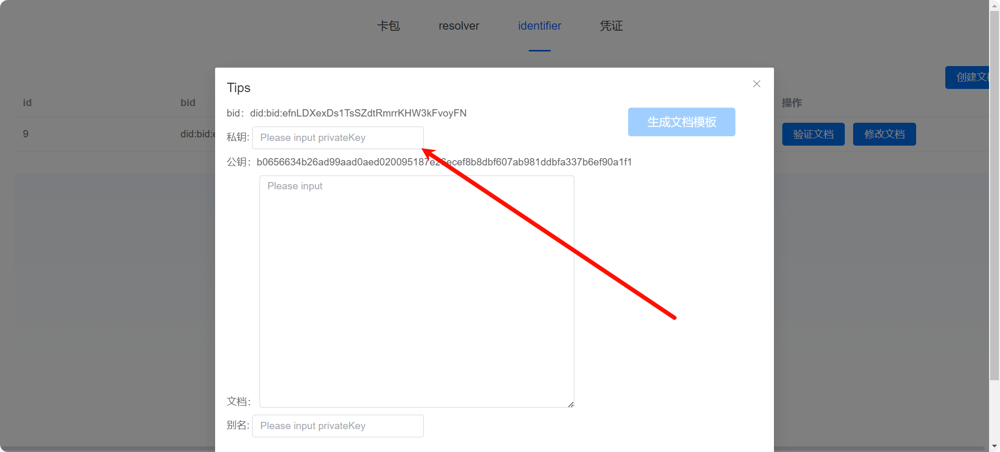

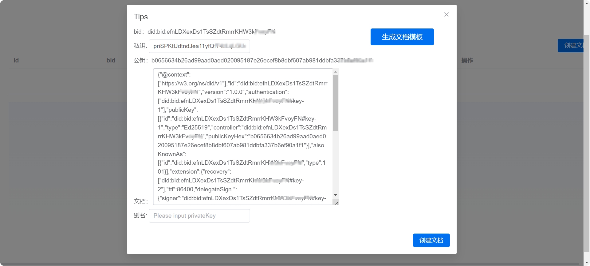

	2）创建文档

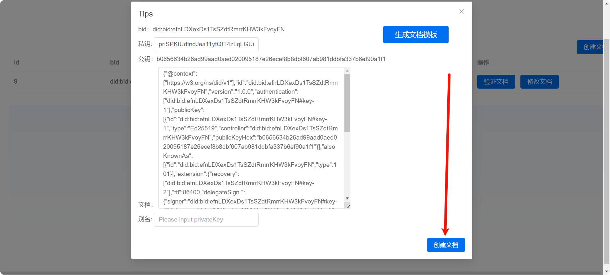


10. 修改文档 数据

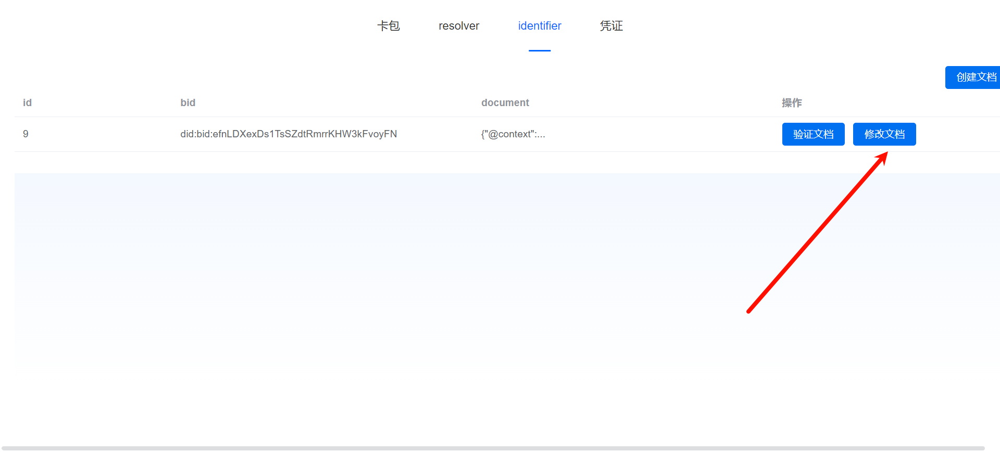

agent 为 后续`issuer`系统推送凭证到当前`holder`系统的agent地址

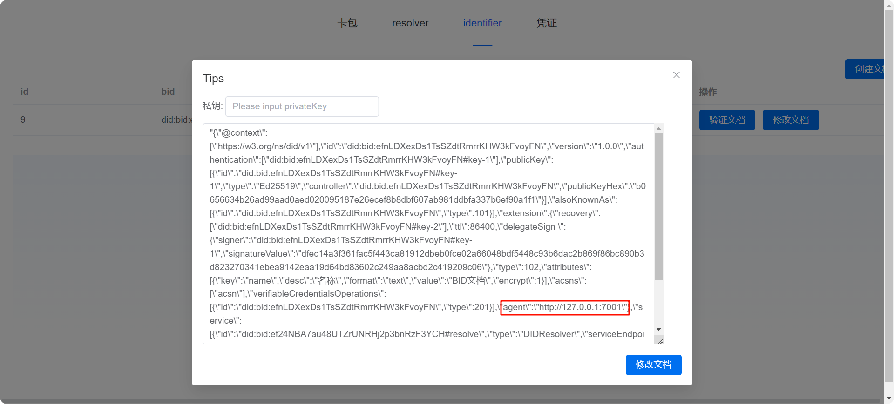


11. 验证文档

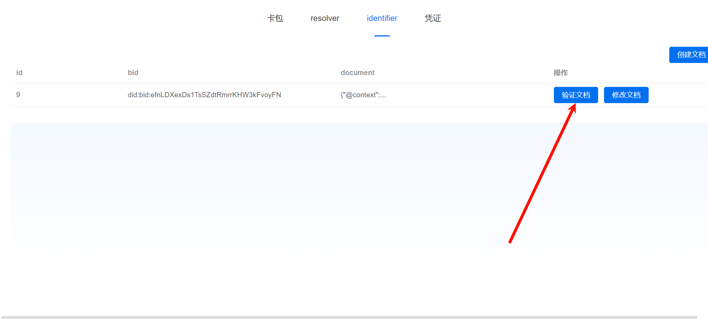


#### 6.4.3.2 Issuer

##### 服务说明：

|      | 服务名       | 端口 |
| ---- | ------------ | ---- |
| 前端 | issuer-web   | 8889 |
| 后端 | issuer-agent | 7002 |

##### 项目配置

###### 前端

1. node环境

	`18.17.0`

2. 接口后端地址配置

   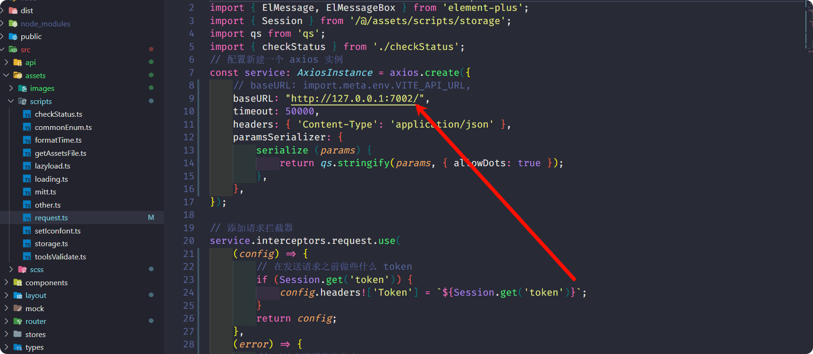

3. 启动项目

```
cd issuer-web
npm install
npm run serve
```

###### 后端

1. node环境

	`18.17.0`

2. 项目配置

	端口号配置


数据库配置


3. 启动项目

```
cd issuer-agent
npm install
npm run dev
```

##### 项目说明

###### 访问地址

` http://localhost:8889/auditList`

###### 凭证审核

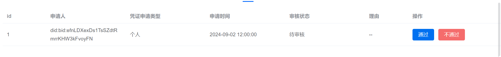

#### 6.4.3.3 Verifier

##### 服务说明：

|      | 服务名         | 端口 |
| ---- | -------------- | ---- |
| 前端 | verifier-web   | 8890 |
| 后端 | verifier-agent | 7003 |

##### 项目配置

###### 前端

1. node环境

	`18.17.0`

2. 接口后端地址配置

   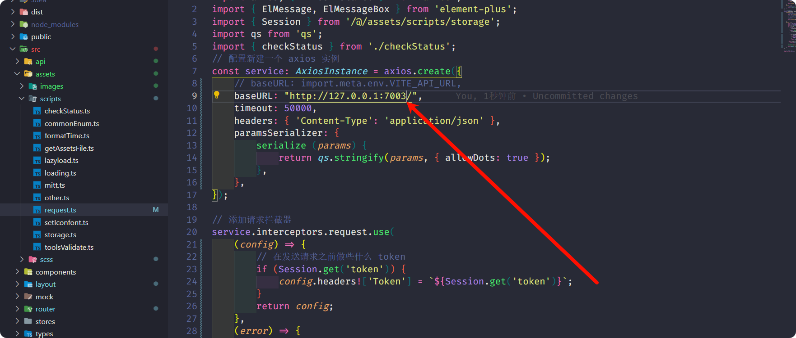

3. 启动项目

```
cd verifier-web
npm install
npm run serve
```

###### 后端

1. node环境

	`18.17.0`

2. 项目配置

	端口号配置


数据库配置


3. 启动项目

```
cd verifier-agent
npm install
npm run dev
```

##### 项目说明

###### 访问地址

` http://localhost:8890/verification`

###### 凭证核验


